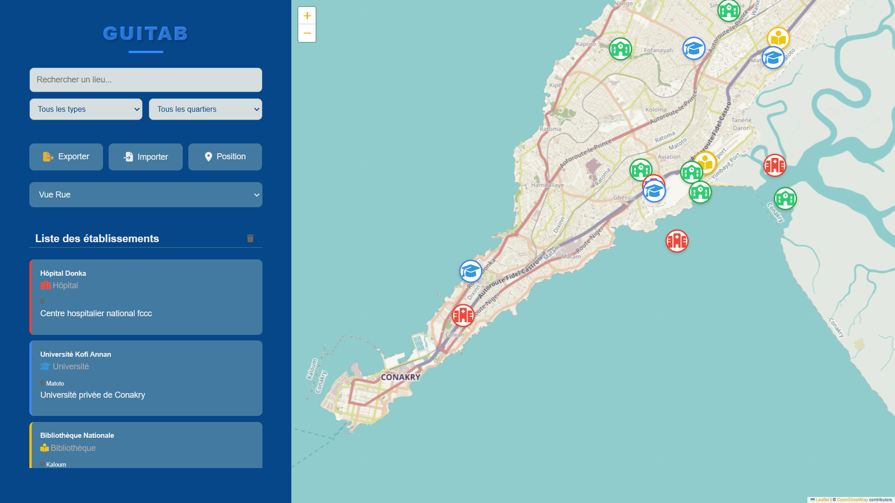
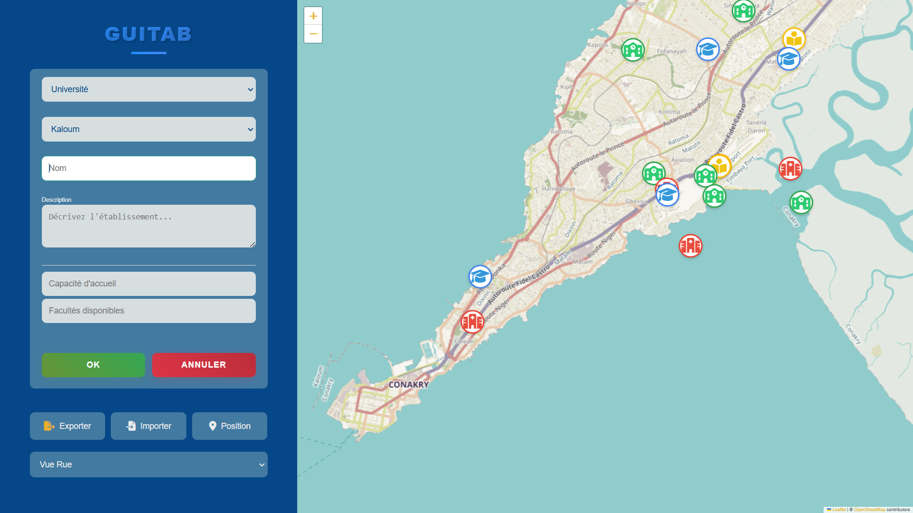
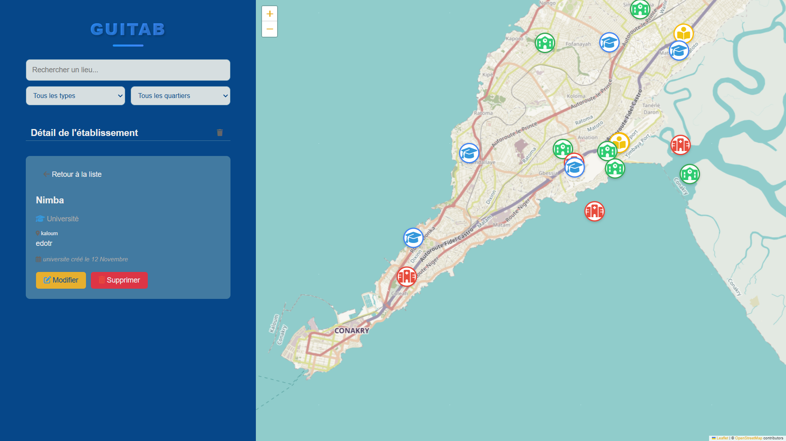
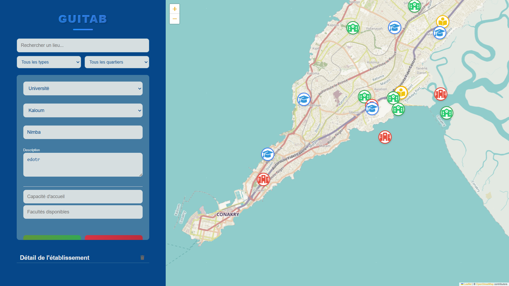
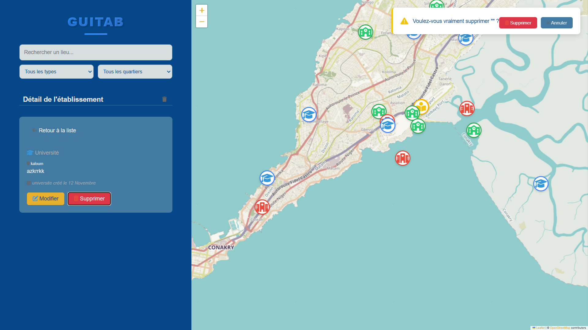
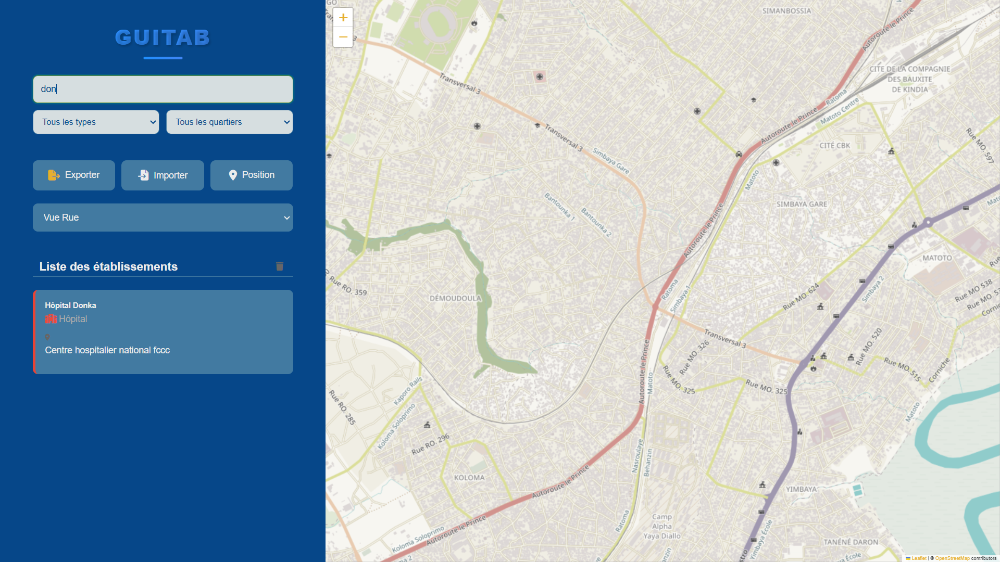
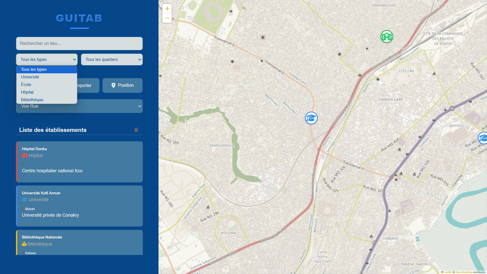
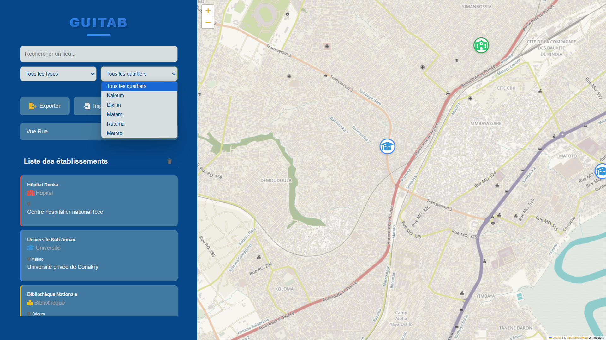
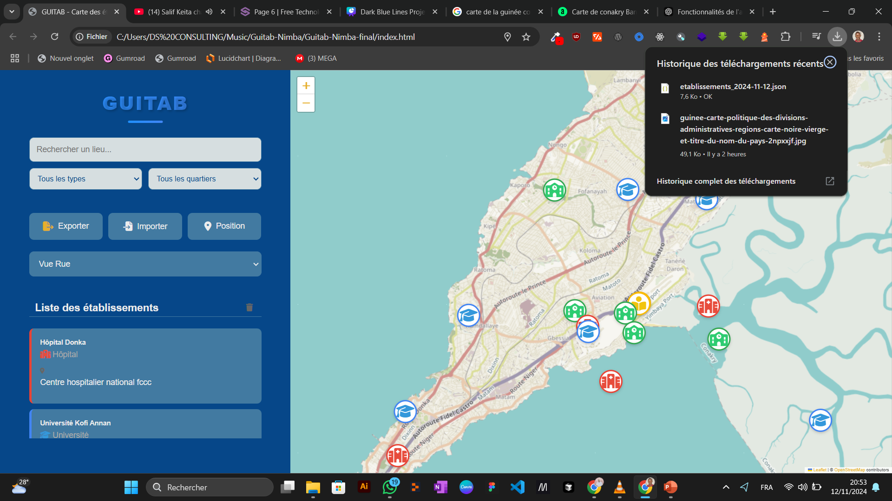
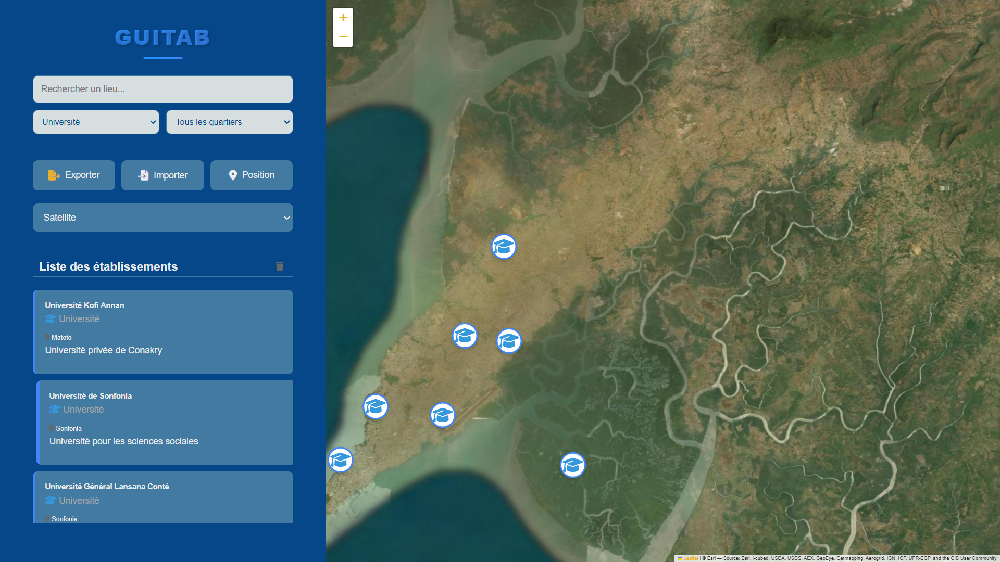

# GUITAB - Carte des Établissements de Conakry 🗺️

GUITAB est une application web cartographique permettant de gérer et visualiser les établissements publics de Conakry, Guinée.

## 📋 Table des Matières

- [Fonctionnalités](#fonctionnalités)
- [Captures d'écran](#captures-décran)
- [Technologies Utilisées](#technologies-utilisées)
- [Installation](#installation)
- [Utilisation](#utilisation)
- [Documentation](#documentation)
- [Contribution](#contribution)

## ✨ Fonctionnalités

- 🏫 Gestion des établissements (Universités, Écoles, Hôpitaux, Bibliothèques)
- 🔍 Recherche et filtrage avancés
- 📍 Géolocalisation en temps réel
- 💾 Import/Export des données
- 🎯 Interface intuitive et responsive
- 📁 Import/Export des données
- 🔍 trouver la position sur la carte
- 🔍 Recherche par nom
- 🔍 Recherche par quartier
- 🎨 choix du type de vue sur la carte

## 📸 Captures d'écran

### Étape 1 : Page d'accueil

- Vue d'ensemble de la carte
- Sidebar avec options de recherche

### Étape 2 : Ajout d'un établissement

- Clic sur la carte
- Formulaire d'ajout

### Étape 3 : Détails et modifications

- Vue détaillée d'un établissement
- Options de modification/suppression
### Modification d'un établissement

- Formulaire pré-rempli avec les données existantes
- Validation des modifications

### Suppression d'un établissement  

- Confirmation de suppression
- Retrait instantané de la carte


### Étape 4 : Recherche et filtres

- Filtrage par type et quartier
- Résultats en temps réel



### Étape 5 : Export des établissements

- Export des données au format JSON
- Sauvegarde complète des établissements
- Possibilité d'import/restauration
### Étape 6 : Import des établissements

- Import des données depuis un fichier JSON
- Validation du format des données
- Fusion avec les données existantes
### Étape 7 : Types de vue sur la carte

- Choix entre vue satellite et vue standard
- Changement dynamique de l'affichage
- Meilleure visualisation selon le contexte


## 🛠️ Technologies Utilisées

- HTML5/CSS3
-  HTML5/CSS3

- JavaScript (ES6+)
-  JavaScript (ES6+)


- Leaflet.js pour la cartographie
-  Leaflet.js pour la cartographie
- LocalStorage pour la persistance
-  LocalStorage pour la persistance

## 📥 Installation
1. Télécharger ou cloner le projet :
   ```bash
   git clone https://github.com/Morymirco/Guitab_nimba_project.git
   ```

2. Ouvrir le dossier du projet :
   ```bash
   cd Guitab_nimba_project
   ```

3. Ouvrir le fichier index.html dans votre navigateur web préféré

## 🚀 Utilisation

- Naviguez sur la carte pour trouver la position de l'établissement
- Utilisez les filtres pour trouver l'établissement
- Ajoutez un établissement en cliquant sur la carte
- Modifiez un établissement en cliquant sur le bouton modifier
- Supprimez un établissement en cliquant sur le bouton supprimer

## 📚 Documentation

Pour plus de détails sur l'utilisation de chaque fonctionnalité, veuillez consulter la documentation en ligne.

## 👥 Contribution

-  **Mory Mirco** - *Chef de projet*
  - Architecture du projet
  - Développement des fonctionnalités principales
  - Documentation technique

-  **Mamadou Ramandan Barry** - *Développeur font-end*
  - Intégration de la carte
  - Gestion des marqueurs
  - Tests et débogage

-  **Djenabou conte** - *Designer*
  - Design de l'interface
  - Expérience utilisateur
  - Intégration CSS